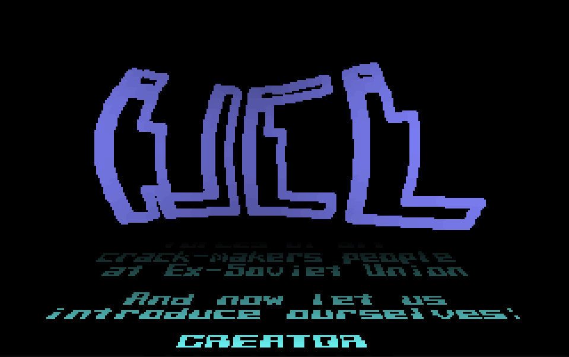

# UCL Intr0 — reverse engineering and JS port



Reverse engineering of `UCL-PLAIN.COM`, a 5798-byte 16-bit DOS COM-file demo
released 1996-03-03 by **SkullCODEr / United Crackers League**, plus a
browser reimplementation that loads the original binary, slices the data
regions out of it at runtime, and reproduces the visuals. Music is played
back from a pre-recorded WAV capture of the original DOSBox playback
rather than re-synthesised in the browser — see *Music* below.

**Play online:** <https://begoon.github.io/ucl>

## Copyright

The original 1996 work `UCL-PLAIN.COM` — including the executable code,
music data, scroll-text greets and creative content — is the work of
**SkullCODEr / United Crackers League** and all rights to that work
remain with the original authors. The binary is preserved verbatim in
this repository (`UCL-expected.bin`, also at `docs/UCL-PLAIN.COM`) for
historical and educational purposes; nothing about its content has
been altered.

The new material in this repository — the disassembly annotations
(`UCL-PLAIN.asm`), the documentation in this README, and the
JS/Canvas port under `docs/` — is released under the **MIT licence**
(see [`LICENSE`](LICENSE)).

## Repository layout

```text
ucl-re/
├── README.md             ← this file (project documentation)
├── UCL-expected.bin      ← canonical copy of UCL-PLAIN.COM (round-trip oracle)
├── UCL-PLAIN.asm         ← hand-curated NASM source that reassembles
│                           byte-for-byte against UCL-expected.bin
├── gen_baseline.py       ← emits an all-`db` baseline .asm from the binary
├── promote_code.py       ← converts ndisasm slices into the labeled,
│                           byte-exact form used in UCL-PLAIN.asm
├── Justfile              ← `just check` / `just diff` / `just serve` / …
│
├── initial/              ← starting point of the RE effort
│   ├── UCL-PLAIN.COM         the unwrapped binary
│   └── UCL-PLAIN.asm         raw ndisasm output for the full file
│
├── dos/                  ← recovery + A/B-test toolchain
│   ├── UCL.COM               the original PKLITE-packed, XOR-encrypted release
│   ├── decode.c / decode.py  XOR/add decryption pass (Py port is byte-identical)
│   ├── UNP.EXE               generic depacker that handles PKLITE
│   ├── capture.py            opens UCL-PLAIN.COM in DOSBox-X for a WAV recording
│   ├── capture.conf          DOSBox-X config used by capture.py
│   ├── analyze.py            spectral / dynamics analysis for A/B testing
│   ├── Justfile              `just check`, `just record-reference`
│   └── README.md             documents the derivation chain
│
└── docs/                  ← JS/Canvas port
    ├── index.html            UI shell with Start/Reset/Original buttons
    ├── script.js             rendering port (no music synth)
    ├── UCL-PLAIN.COM         fetched at runtime; all data sliced out of it
    ├── music.wav             pre-recorded one-loop capture of the original
    │                         music, played back via <audio loop>
    └── original/             host folder for the original DOS binary
                              (DOSBox/js-dos handoff target)
```

## Quick start

```sh
# Round-trip check: reassemble disassembly, cmp against the binary
just check          # reassemble UCL-PLAIN.asm with nasm and cmp vs UCL-expected.bin
just diff           # unified hex diff if check fails
just bytes-different
just first-diffs 20

# Web port
just serve          # python3 -m http.server, then open http://localhost:8000/docs/
```

## How `UCL-PLAIN.COM` was derived from `UCL.COM`

The release artifact in the wild is `UCL.COM` (3966 bytes) — a
PKLITE-compressed COM wrapped in a custom XOR/add encryption layer.
The disassembly target `UCL-PLAIN.COM` (5798 bytes) is what falls out
after both layers are peeled off:

```text
UCL.COM  ──[ decode.c / decode.py ]──▶  UCL-RAW.COM  ──[ UNP.EXE ]──▶  UCL-PLAIN.COM
            (XOR/add decryption,                       (PKLITE V1.50
             same size, 3966 bytes)                     self-extractor,
                                                        expands to 5798 bytes)
```

### Stage 1 — XOR/add decryption (`decode.c` / `decode.py`)

`UCL.COM` begins with a near `JMP` to a small decryption stub near
the end of the file. The decoder mirrors what the stub would do at
runtime: it places the file at COM offset `0x100`, reads the `JMP`
target to find the stub, then reads three values out of the stub:

- `CX = 0x0F4B` — bytes to decrypt
- `DI = 0x106E` — pointer to a 16-byte XOR pad
- (entry-point word, restored at the end)

It then walks `SI = 0x100 .. 0x100+CX-1`:

```text
buf[SI] = (buf[SI] XOR pad[i AND 0x0F]) + (SI AND 0xFF)
```

— a position-dependent XOR keyed off a 16-byte pad, with a per-byte
additive bias derived from the low byte of the file offset. The
output (`UCL-RAW.COM`, same 3966 bytes) is still a packed
self-extractor, but its leading bytes now look like a normal COM:
the print stub `mov ax,0x0900 / int 21h` at offset `0x80`, followed
by the PKLITE depacker body.

### Stage 2 — PKLITE depack (`UNP.EXE`)

UNP identifies the inner packer as **PKLITE V1.50** and expands the
payload to **5798 bytes** — the plain binary `UCL-PLAIN.COM` that
the rest of this README disassembles. The same identifying strings
(`-UCL- Intr0 by SkullC0DEr`, `Preparing data...`, `UNITED CRACKERS
LEAGUE`) appear in both files, confirming they are the same program
at different unwrap stages.

### Why this exact order

- `decode.c` is hard-wired to `UCL.COM`'s leading `JMP` stub. It
  dereferences the JMP target to find the decryption parameters, so
  it can only be applied to the encrypted form.
- `UNP.EXE` matches packers by signature. `UCL.COM`'s opening bytes
  are XOR-encrypted, so UNP cannot identify the inner packer until
  after stage 1 reveals the PKLITE signature.

Full reproduction (with byte-identical output assertions) lives in
[`dos/README.md`](dos/README.md) — `just check` from inside `dos/`
runs both stages in a sandbox and `cmp`s the result against the
shipped `UCL-PLAIN.COM`.

## What the demo does

1. Prints a banner via DOS `int 21h ah=9`, switches to VGA mode 13h (320×200×256).
2. Programs a 256-entry palette as **three 64-entry ramps**, used as logical
   colour "layers" by the renderer (see [Palette](#palette-ramps)).
3. Runs an unsynchronised main loop that per frame:
   - rasterises one new row of scrolled credit text into a GS-segment bitmap
     and shifts the bitmap up by 1 row;
   - projects 64 scan-lines of that bitmap onto the bottom of the screen via a
     precomputed perspective LUT (the receding "Star Wars" floor);
   - for each point of the UCL 3-D point cloud, first erases its previous
     screen position with a black brush, then perturbs `z` via a smooth noise
     table and projects the new position with depth-shaded colour;
   - waits for VGA vertical retrace, blits the offscreen buffer to `0xA000`.
4. Steps an AdLib / OPL2 song driver from a hooked timer ISR (`int 08h`) at
   ~9 Hz: 9 independent byte streams, each a `note | duration` sequence.
5. Exits on `ESC` with a brief white-out + palette-walk fade.

## Greets dump (`fading-text.txt`)

`fading-text.txt` is a plain-text dump of the demo's scroll-text
region — the credits and greets that the original scrolls along the
perspective floor. It's an extract of bytes `0x0C86 – 0x1485` of
`UCL-PLAIN.COM`, with the two in-band control bytes stripped/translated:

- `0x7E` (`~`) — colour-bank toggle, deleted entirely.
- `0x7F` — line-break, replaced with `\n`.

The remaining `{ | } + * %` characters are *not* punctuation: they
are the source-side encoding of graphical block tiles in the demo's
8×8 font atlas, which is what draws the closing "UCL" bracket art
at the end of the message.

The file is regenerated with:

```sh
just fading-text       # writes fading-text.txt at repo root
```

A copy lives under `dos/fading-text.txt` as a historical reference
alongside the `UCL.COM` derivation toolchain.

## Memory map of the binary

| Range            | Purpose                                                           |
|------------------|-------------------------------------------------------------------|
| `0x100 – 0x660`  | Code                                                              |
| `0x661 – 0x669`  | 9 bytes: per-channel "ticks until next event" countdown           |
| `0x66A – 0x683`  | OPL2 F-number table — 12 (lo, hi) word pairs                      |
| `0x684 – 0x68C`  | OPL2 patch parameters (per-channel timbre bytes)                  |
| `0x68D – 0x6EB`  | Init scratch / OPL2 register address table                        |
| `0x6EC – 0x70F`  | 9 `(current_ptr, rewind_ptr)` word pairs (song read state)        |
| `0x710 – 0xABF`  | Song data — 9 byte streams of notes + duration overrides          |
| `0xAC0`          | "Frames until next music tick" countdown for timer ISR            |
| `0xAC1 – 0xAE2`  | Timer interrupt service routine (`int 08h` handler)               |
| `0xAE3 / 0xAE5`  | Word vars: scroll-bitmap write ptr / scroll-text read ptr (init 0x349E / 0x0C86) |
| `0xAE8 / 0xAEA`  | Word vars: noise-driven X/Y wobble offsets for UCL flag           |
| `0xAEC / 0xAEE`  | Word vars: dynamic X/Y "focal length" (animates to 0x133 / 0x100) |
| `0xAF0`          | Frame counter (drives the noise-table index)                      |
| `0xAF1 – 0xC55`  | Packed bitmap of the UCL letters (40 rows × 9 cols × 8 bits)      |
| `0xC59 – 0xC85`  | DOS print string `"-UCL- Intr0 by SkullC0DEr\r\nPreparing data..."` |
| `0xC86 – 0x1484` | Scroll-text body (greets + member list), `0x7F`-separated lines   |
| `0x1485 – 0x1499`| Final loop-forever scroll fragment (closing UCL bracket art)      |
| `0x149A – 0x1799`| Packed 8×8 font, 96 glyphs × 8 bytes (chars `0x20-0x7F`)          |
| `0x179A – 0x179B`| Word var (point-count cache from previous frame)                  |
| `0x179C – 0x179F`| Word var: scroll-text colour-attribute toggle (XORed by `~`)      |
| `0x17A0 – 0x17A5`| 6 bytes: LFSR seed state                                          |
| `0x17A6 – 0x1B9D`| 254 dwords of LFSR state generated at startup                     |
| `0x1B9E – 0x1C9D`| 256-byte signed noise table (the smooth wave)                     |
| `0x1C9E – 0x349D`| Unpacked 8-bpp font atlas (96 glyphs × 64 bytes)                  |
| `0x349E – 0x489D`| Scroll-text bitmap ring buffer (DS-side rasterisation target)     |
| `0x489E – 0x499D`| Perspective LUT (64 entries × 4 bytes: `di_start`, `step`)        |
| `0x499E – 0x4B2D`| `y * 320` row-offset LUT (200 entries × 2 bytes)                  |
| `0x4B2E – 0x62FD`| UCL 3-D point cloud (6 bytes per point: `x, y, z`)                |
| `0x62A0+`        | Per-frame buffer of brush screen-offsets, used for prev-frame erase |

`file_offset = mem_addr - 0x100`. The COM also uses two extra 64 KB
segments above the PSP: `ES = DS + 0x1000` (offscreen render buffer that
becomes the source for the final blit) and `GS = DS + 0x2000` (scroll-text
bitmap workspace).

## Palette ramps

The palette is split into 4 logical bands; the *high two bits* of a pixel
byte choose the band, the low bits choose brightness within it:

| Pixel range        | Meaning                          | Used by               |
|--------------------|----------------------------------|-----------------------|
| `0x00 – 0x3F`      | Red / orange ramp                | (unused at runtime)   |
| `0x40 – 0x7F`      | Cyan-to-white ramp (R = G slow, B fast) | scroll-text floor + gradient backdrop |
| `0x80 – 0xBF`      | Purple / bluish ramp             | UCL letters           |
| `0xC0 – 0xFF`      | Initially black; rewritten during exit fade | white-out / palette-walk |

The exact ramp generation is at asm `0x220 – 0x259`. UCL letter colour
computed by the renderer (`0x3A8 – 0x3B4`) is
`c = -(((z - 0xFA) >> 3) + 0x82) & 0xFF`, which for typical perturbed
`z ≈ 380` lands at `0x6E-0x72` — inside the green-purple ramp, with
adjacent indices nearly indistinguishable, hence the "one-colour" look.

## Initialisation walk-through (`0x100 – 0x25C`)

1. **Banner**: `int 21h ah=9` prints the "Preparing data…" string.
2. **Noise/sine table generation** (`0x107 – 0x138`). A 32-bit
   multiplicative recurrence:

   ```text
   state[i] = ((state[i-1] * 0x7FF62182) >> 30) - state[i-2]
   noise[i] = (state[i] >> 23) as signed byte
   ```

   The two seeds come from bytes `0x179E` and `0x17A2` in the binary.
   Result: a 256-byte signed wave at `0x1B9E` used for both the UCL flag
   wobble and the per-frame increment of the wobble offsets.

3. **Font unpack** (`0x13A – 0x156`). Reads the 768-byte packed font at
   `0x149A` and expands each source bit into one byte at `0x1C9E`
   (`0x00` for clear, `0x3F` for set). Result: 96 glyphs × 64 bytes.

4. **Perspective LUT** (`0x157 – 0x172`). 64 entries × 4 bytes at `0x489E`.
   First word of each entry is the screen byte-offset where that scan-line
   starts (line 0 = `0xF8C0` = row 199 col 0 — the bottom of the screen).
   Second word is a 16-bit step added per texture sample to an
   accumulator; the screen pixel position advances by 1 only on
   overflow. Smaller `step` ⇒ fewer screen pixels ⇒ the row appears
   squeezed toward screen-centre in the distance. Both decrement per row.

5. **`y * 320` row LUT** at `0x174 – 0x182`, 200 entries at `0x499E`.

6. **Unpack UCL point cloud** (`0x184 – 0x1CC`). The packed bitmap at
   `0xAF1` is read as 40 rows × 9 cols × 8 bits. For every *cleared* bit
   (it's inverted) a six-byte 3-D point `(x, y, z)` is written to `0x4B2E`:

   ```text
   x = (col*8 + bit) * 3 - 0x6C        // ≈ -108..+108  (centred)
   y = row * 3 - 0x5A                  // ≈  -90..+27
   z = 0x17C                           // = 380 (initial depth)
   ```

   The total point count is saved to `[0x629E]`.

7. **Reprogram PIT channel 0** to mode 3 with divisor `0xFFFF` (slowest
   tick rate). The IRQ is used purely to step the music driver — visuals
   are decoupled.

8. **Init AdLib** (`call 0x597`) — writes the patch program (see
   [Music driver](#music-driver-adlib-opl2)).

9. **Hook `int 08h`** to the routine at `0xAC1`; save the old handler at
   `[0x6A70/0x6A72]` for the exit path.

10. **Allocate two extra segments**: `ES = DS + 0x1000` (offscreen render
    buffer, 64000 bytes — exactly one mode-13h frame); `GS = DS + 0x2000`
    (scroll-text bitmap workspace). Both are zeroed.

11. **Enter mode 13h** (`int 10h ax=0x13`).

12. **Program the VGA palette** at `0x3C8 / 0x3C9` — three ramps as
    described in [Palette ramps](#palette-ramps).

13. `sti`, set `[0xABF] = 1` (master "music running" flag for the ISR),
    fall into the main loop.

## Main render loop (`0x262 – 0x40A`)

### A. Scroll-text bitmap step (`0x262 – 0x2F6`)

```text
ES = GS = DS+0x2000 temporarily; rep movsd 0x1400 dwords from GS:0x140 to GS:0
  → shifts the entire 64-row scroll-bitmap up by one row
mov si, [0xAE3]; rep movsd 0x50 dwords (= 320 bytes) from DS:si to ES:0x4EC0
  → copies the next row of the *pre-rasterised* DS-side bitmap (the regen
    target) into the bottom of the GS-side bitmap as the new row
[0xAE3] += 320
restore ES = DS+0x1000

if (si - 0x349E) == [0x179C]:        ; reached the end of the DS bitmap
    regenerate: zero 0x500 dwords from 0x349E
    walk text bytes from [0xAE5] until 0x7F:
        if 0x7E:  [0x179C] ^= 0x1E00 ; colour-bank toggle (alters next regen threshold)
        else:     blit char into DS bitmap, 16 wide × 8 tall, value 0x00/0x3F
    save updated [0xAE5]; loop back to 0x1485 if the message ran out
```

Key correction over the first pass of analysis: **`0x7F` is a line-break,
not end-of-message**. The regen loop terminates on each `0x7F` leaving the
remaining text for the *next* regen pass, so each regen fills one block of
glyph rows. End-of-message wraps the read pointer to the closing
loop-forever bracket fragment at `0x1485`.

### B. Perspective floor projection (`0x2F7 – 0x332`)

For each of 64 scan-lines:

```text
di = lut[line].di_start                        ; screen byte-offset
bx = lut[line].step                            ; 16-bit fixed-point increment
bp_acc = 0
for tex_x = 0..319:
    al = gs:[si + tex_x]                       ; sample texture
    al = al + cl - 0x3F                        ; cl counts 0x40 → 1 (backdrop gradient)
    es:[di] = al                               ; plot
    bp_acc += bx; di += (bp_acc overflow ? 1 : 0)
si -= 0x140                                    ; sample older bitmap row next line
```

The pixel formula `tex + cl - 0x3F` writes a gradient backdrop even where
the bitmap is empty — that's what refreshes the floor area each frame and
erases any UCL trails that strayed there. Near lines have `step ≈ 0xFFFF`
(1:1 mapping); far lines have small `step` so 320 texture samples cover
only ~190 distinct screen pixels, producing the vanishing-point wedge.

### C. UCL flag — 3-D point cloud with wobble (`0x334 – 0x3BF`)

**Erase pass first**, then plot. The asm at `0x334 – 0x348` walks the
buffer of *previous frame's* screen positions (saved at `0x62A0`) and
calls the brush dispatcher with `eax = 0` at each one — colour zero, which
in the dispatcher's size selector becomes `(0 - 1) & 0x3F = 0x3F` and so
unconditionally plots the **large** 6×6 brush. This is what keeps the UCL
area from accumulating trails into a solid colour wash.

For each 3-D point `(x, y, z0)`:

```text
nx = noise[(wobX + x) & 0xFF]
ny = noise[(wobY + y) & 0xFF]
z  = ((nx + ny) >> 1) + z0          ; AVERAGE — sar bp,1 (ndisasm prints as "sar bp,0x0")
sx = (x * focalX) / z + 160
sy = (y * focalY) / z + 100
colour = -(((z - 0xFA) >> 3) + 0x82)
plot_brush(es:[row_lut[sy] + sx], colour)
save (sx, sy) to the prev-position buffer for next frame's erase
```

Per-frame motion update:

```text
wobX += noise[frame] >> 5            ; ±4
wobY -= (noise[frame] >> 5) - 1
frame = ++[0xAF0]
focalX → 0x133 step 5                ; "breathing" focal length
focalY → 0x100 step 5
```

The `>> 1` averaging of the two noise samples is critical — without it
worst-case `z` drops low enough that projection sends letters off-screen.

### D. Brush dispatcher (`0x503 – 0x596`)

Picks one of three solid same-colour rounded-square footprints by
`(colour - 1) & 0x3F`:

| size-idx range | brush | shape |
|----------------|-------|-------|
| `0x00 – 0x25`  | small (4×4) | `.XX. / XXXX / XXXX / .XX.` |
| `0x26 – 0x2F`  | medium (5×5) | `.XXX. / XXXXX / XXXXX / XXXXX / .XXX.` |
| `0x30 – 0x3F`  | large (6×6) | `.XXXX. / XXXXXX / XXXXXX / XXXXXX / XXXXXX / .XXXX.` |

All pixels carry the same colour byte. Note that **the size value drops
the high two bits** of the colour, so the size depends only on the
brightness within the ramp, not which ramp it's in.

### E. Vsync + blit (`0x4E1 – 0x502`)

`call 0x4E1` polls VGA status register `0x3DA` bit 3 (one transition
out of, one into vblank), then `rep movsd 0x3E80` copies ES to
`0xA000:0000`. There is **no per-frame blur** in the main loop — the
3-tap recurrence at `0x460 – 0x4C2` is reached only via the exit path.

### F. Exit (`0x404 – 0x4E0`)

Reads keyboard scan code from port `0x60`, exits on `ESC`. Restores the
saved `int 08h` handler, calls `0x597` again to silence the AdLib chip
(zeros key-on bits), runs the post-process blur as a fade-to-zero loop,
walks the palette to black via vsync-paced writes, and returns to text
mode (`int 10h ax=0x03`).

## Music driver (AdLib OPL2)

### Init (`0x597`)

Globals first: `reg 0x01 = 0x20` (WSE on, enables non-sine waveforms),
`reg 0x08 = 0x00` (NTS off), `reg 0xBD = 0x00` (rhythm mode off). Then
9 channels are programmed by walking two parallel tables:

- **`0x68D`** — 9 word pointers, one per channel, into the patch-data
  pool at `0x69F – 0x6EB`. Channels 2/3 share a pointer, as do 5/6 —
  there are 7 unique patches.
- **`0x684`** — 9 bytes, the operator-0 register-block base for each
  channel: `20 21 22 28 29 2A 30 31 32`. These are `0x20 + op0_offset`
  where `op0_offset` is the standard OPL2 non-contiguous operator
  index (channels 0-2 use offsets 0-2, channels 3-5 use 8-A, channels
  6-8 use 10-12).

For each channel the asm inner loop reads **6 bytes** from the patch
and writes them to specific registers:

| Patch byte | OPL2 register      | Meaning                                |
|-----------:|--------------------|----------------------------------------|
| 0          | `0x20 + op0`       | MULT, KSR, EGT, VIB, AM                |
| 1          | `0x40 + op0`       | KSL (bits 6-7), TL (bits 0-5)          |
| 2          | `0x60 + op0`       | AR (bits 4-7), DR (bits 0-3)           |
| 3          | `0x80 + op0`       | SL (bits 4-7), RR (bits 0-3)           |
| 4          | `0xE0 + op0`       | WS — waveform select (bits 0-1)        |
| 5          | `0xC0 + ch`        | FB (bits 1-3), CNT (bit 0) — channel   |
| 6-10       | *(unused)*         | each patch is 11 bytes; bytes 6-10 are |
|            |                    | never read by the asm                  |

Only **operator 0** of each channel is configured. Operator 1 (the
carrier) stays at the OPL2 hardware reset state (TL=0, all rates 0,
MULT=0, WS=0). This is intentional: for `CNT=1` (AM) channels the op0
output alone reaches the mix; for `CNT=0` (FM) channels the
"defaulted" op1 acts as the carrier modulated by op0.

A `xor ax,ax; call 0x650` after each channel's patch sequence sends a
key-off (zeros to `A0+ch` and `B0+ch`).

The 7-NOP delay (`call 0x64C` with `cx=7`, then `cl=0x30`) is the
standard OPL2 write-status latency wait.

### Per-channel patch summary

Hand-decoded from the patch pool at `0x69F – 0x6EB`. AR=0 entries are
called out because textbook OPL2 silences them but real chips
(and DOSBox-X's default emulator `dbopl`) *don't* — see the next subsection.

| Patch | Channels | MULT | TL  | AR | DR | SL | RR | WS  | FB | CNT |
|------:|----------|------|----:|---:|---:|---:|---:|-----|---:|----:|
| P0    | ch0      | 0×   | 0   | **0** | 8  | 8  | 0  | 1 half | 2 | 1 AM |
| P1    | ch1      | 0×   | 16  | **0** | 8  | 8  | 0  | 1 half | 2 | 1 AM |
| P2    | ch2, ch3 | 1×   | 0   | 8  | 7  | 8  | 0  | 3 quart | 7 | 1 AM |
| P3    | ch4      | 1×   | 0   | 8  | 7  | 8  | 0  | 3 quart | 7 | 1 AM |
| P4    | ch5, ch6 | 0×   | 0   | **0** | 0  | 0  | 13 | 1 half | 0 | **0 FM** |
| P5    | ch7      | 1×   | 0   | 8  | 7  | 8  | 0  | 3 quart | 7 | 1 AM |
| P6    | ch8      | 1×   | 0   | 1  | 2  | 8  | 8  | 1 half | 2 | 1 AM |

`KSL` values: P0=1, P1=0, P2=1, **P3=3** (steepest), P4=2, P5=2, P6=0.

### Per-channel role (from song-stream and spectral analysis)

Looking at the first bytes of each channel's stream at `0x710 – 0xABF`:

| Ch | First bytes      | Initial behaviour                            | Role               |
|---:|------------------|----------------------------------------------|--------------------|
| 0  | `C0 22 …`        | silent for 64 ticks, then notes              | sub-bass (MULT=0.5)|
| 1  | `FC 20 …`        | silent for ~124 ticks                        | sub-bass           |
| 2  | `C0 42 …`        | silent for 64 ticks                          | mid (quarter-sine) |
| 3  | `C0 42 …`        | silent for 64 ticks                          | mid                |
| 4  | `FF 81 …`        | silent for ~127 ticks                        | **bass voice**     |
| 5  | `32 9F …`        | note immediately (`0x32` = D, block 3)       | FM-bass            |
| 6  | `42 FF …`        | note immediately                             | FM                 |
| 7  | `40 81 …`        | note immediately (lead voice's first hit)    | lead (mid)         |
| 8  | `FF FF …`        | silent for ~127 ticks                        | mid                |

ch4's patch P3 is the key bass voice. Its song alternates between note
byte `0x32` (D3 ≈ 154 Hz) and `0x54` (E5 ≈ 695 Hz); with `KSL=3` the
E5 notes get attenuated ~12-24 dB so D3 is what dominates the mix.
Reference recording confirms: the dominant FFT peak across 4 of 5
timeline slices is **154 Hz**.

### The AR=0 hardware quirk

The demo's patches P0, P1, P4 all set `AR=0` on operator 0. By the
documented OPL2 envelope rules an `AR=0` operator stays at silence
forever — the attack rate is zero, so the envelope never leaves its
reset value. Four channels would be silent.

But the reference WAV (a DOSBox-X capture made with its default
emulator `dbopl`) shows **9.7% sub-bass and a dominant 154 Hz peak
from the very start** — energy that can only come from those AR=0
channels. So real chips, and the emulators that match them, treat
`AR=0` as **"no attack ramp — jump straight to peak"** rather than
"never attack". The demo's author relied on this behaviour: their
sub-bass voices are written *expecting* `AR=0` to produce sound.

Practical consequence in the JS port:

- Hand-rolled emulators implementing the textbook rule are silent
  on those channels (verified by analyzer: 0.6% sub-bass vs the
  reference's 9.7%).
- Real-hardware-faithful emulators (Nuked-OPL3, dbopl) handle this
  correctly out of the box.

### Per-tick step (`0x5DB`)

Called from the timer ISR every 2 IRQs ⇒ ~9 Hz. Iterates 9 channels; for
each:

```text
sub byte [0x661+ch], 1
jns next_channel              ; signed: still positive ⇒ skip

repeat:
    al = lodsb from [di] (the channel's current song pointer)
    if al == 0:                   ; end-of-stream
        si = [di+2]               ; rewind to saved start
        continue
    if al & 0x80:                 ; duration override
        [0x661+ch] = al - 0x81    ; signed -1..0x7E
        save si to [di]; break
    else:                         ; note byte
        note  = al & 0x0F
        block = (al >> 2) & 0xFC  ; OPL B0 register block bits (key-on bit included)
        send key-off to channel
        f = note_table[note]      ; 16-bit (lo, hi) pair from 0x66A
        out (0xA0+ch) = f.lo
        out (0xB0+ch) = f.hi + block
        save si to [di]; break
```

Note that the per-channel duration counter is **only reset by an explicit
duration override**. After playing a note the counter stays at `-1`, so
the next tick also fires and reads the *next* byte — i.e. consecutive
note bytes play one per tick until a `0x80+` byte resets the rate.

### Timer ISR (`0xAC1`)

```text
push ax / ds; ds = cs
if [0xABF]:                       ; demo running
   if --[0xAC0] == 0:
      [0xAC0] = 2                 ; advance music every 2 ticks
      pusha; call 0x5DB; popa
out 0x20, 0x20                    ; EOI
iret
```

### Song format

9 byte streams. Per-channel current and rewind pointers live as
`(cur, rew)` word pairs at `0x6EC – 0x70F`. Stream bytes:

| Byte          | Meaning                                                                 |
|---------------|-------------------------------------------------------------------------|
| `0x00`        | end-of-stream → `cur ← rew`                                             |
| `0x80 – 0xFF` | duration override; new counter = `byte - 0x81`                          |
| `0x01 – 0x7F` | note-on: low nibble = chromatic step (0..11), upper nibble = block bits |

Frequency in Hz from the OPL2 register pair:

```text
f_num = ((note_table[note].hi + block) & 0x03) << 8 | note_table[note].lo
block_idx = ((note_table[note].hi + block) >> 2) & 0x07
freq_Hz = f_num * 49716 / 2^(20 - block_idx)
```

## JS port (`docs/` — served via GitHub Pages)

### Rendering

`docs/script.js` loads `UCL-PLAIN.COM` at runtime, slices every data
region out of the same byte offsets documented above, and runs three
render passes per frame into a `Uint8Array` framebuffer that is sampled
through a 256-entry RGBA palette and uploaded via `ctx.putImageData`.

Implemented faithfully:

- 3-ramp palette generation from the asm at `0x220 – 0x259`.
- LFSR noise table seeded from the same `0x179E / 0x17A2` bytes the
  binary itself uses.
- 8×8 font unpack.
- UCL point-cloud decode + per-frame wobble + perspective projection.
- Prev-frame brush erase pass.
- Three brush shapes (4×4 / 5×5 / 6×6) dispatched by `(colour - 1) & 0x3F`.
- Perspective floor LUT with per-line fixed-point texture-x step.
- `0x7F`-separated text pre-rasterisation into a tall bitmap; row sampled
  per scan-line; per-line backdrop gradient.
- Scroll-text read pointer starts at `0xC86` (initial `[0xAE5]` in the
  binary), *not* at `0xC83` — the three preceding bytes (`..$`) are the
  trailing tail of the DOS "Preparing data…" print-string and are not
  part of the scroll content.

Not (yet) replicated:

- The exit white-out + palette-walk fade.
- The full asm-side scroll-text regen with `~` colour-bank toggle (the
  bank toggle exists in the JS but is approximated).

### Music

The JS port does **not** synthesise the OPL2 song any more. Earlier
revisions of this repo wired up a real chip emulator (Nuked-OPL3
compiled to WASM, driven by a faithful reproduction of the asm's
`(register, value)` byte stream) and the spectral *shape* of the
output landed within ~2 pp of a DOSBox-X reference recording on every
band — but specific per-slice FFT peaks still drifted, the perceptual
A/B felt off, and the result wasn't worth shipping. Instead, the port
plays back a clean one-loop capture of the original demo's audio
(`docs/music.wav`, see *How to capture music on Mac* below) via an
`<audio loop>` element gated on the same user-gesture that starts the
visual loop. Track length is **49.3 s** — a single song loop, with
leading silence and the start of the next loop trimmed off so the
`<audio loop>` attribute tiles seamlessly. See the *Music driver*
section above for the asm-side details that are no longer
re-implemented at runtime.

## How to capture music on Mac

Capturing the audio of a DOS demo running in DOSBox cleanly (no mic,
no system noise, bit-perfect) on macOS uses the [BlackHole][bh]
virtual audio device to route the demo's output into Audacity.

[bh]: https://existential.audio/blackhole/

### 1. Install BlackHole

```sh
brew install blackhole-2ch
```

Reboot afterwards so the new audio driver registers with CoreAudio.

### 2. Create a Multi-Output device

Open *Applications → Utilities → Audio MIDI Setup*, then:

- Click the **+** button bottom-left.
- Select *Create Multi-Output Device*.
- Check both your usual headphones / speakers **and** *BlackHole 2ch*.

### 3. Route the app audio into it

*System Settings → Sound → Output* → select the **Multi-Output
Device** you just created. You still hear audio through your usual
output, and BlackHole receives the same digital stream in parallel.

### 4. Record it

Install Audacity (<https://www.audacityteam.org/>), open it, and in
the top input-source dropdown pick **BlackHole 2ch**. Press *Record*,
launch the demo (`dos/UCL.COM` in DOSBox-X), let it play one full
loop, stop, and export as WAV.

No mic, no QuickTime — bit-perfect internal capture.

## Round-trip self-check

`UCL-PLAIN.asm` is hand-curated so that `nasm -f bin` produces an output
that is byte-identical to `UCL-expected.bin`. To guarantee that despite
NASM-vs-TASM encoding ambiguities (`mov ah, al` can be encoded as either
`8A E0` or `88 C4`; ALU reg-reg ops similarly; `shl r, 1` has an implicit
form), every instruction is emitted as a literal `db` of its actual
bytes, with the mnemonic from ndisasm carried in a trailing comment and
proper `L_xxxx:` labels at every branch target. The result reassembles
verbatim *and* is navigable.

- `python3 promote_code.py` re-runs the ndisasm-to-`db` promotion for
  the code range `0x100 – 0x660`.
- `python3 gen_baseline.py UCL-expected.bin UCL-PLAIN.asm` blows the file away
  back to all-`db` (use when starting a fresh annotation pass).
- `just check` is the green-light: it builds and `cmp`s.

The pattern lets us iteratively annotate while always being able to
prove no byte drifted.
